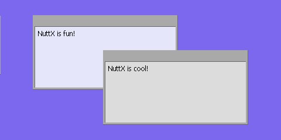

.. _nx_graphics:

=====================
NX Graphics Subsystem
=====================

Introduction
============

NX provides a tiny windowing system in the spirit of X, but greatly scaled
down and appropriate for most resource-limited embedded environments.

.. _fig_nx_screenshot:

   Example NX application.

Picture above presents screenshot of the final frame for the
:ref:`examples_nx` available at ``nuttx-apps/examples/nx/`` running
on the simulated, Linux x86 platform with simulated framebuffer output
to an X window.
This picture shows two framed windows with (blank) toolbars.
Each window has displayed text as received from the NX keyboard interface.
The second window has just been raised to the top of the display.

.. contents::
   :depth: 5

.. include:: objectives.rst
.. include:: organization.rst

NX User APIs
============

Header Files
------------

``include/nuttx/nx/nxglib.h``
   Describes the NXGLIB C interfaces
``include/nuttx/nx/nx.h``
   Describes the NX C interfaces
``include/nutt/nxtk.h``
   Describe the NXTOOLKIT C interfaces
``include/nutt/nxfont.h``
   Describe the NXFONT C interfaces

.. include:: nx.rst_
.. include:: nxgl.rst_
.. include:: nxtk.rst_
.. include:: nxfonts.rst_
.. include:: nxcursor.rst_
.. include:: nxwm_threading.rst_
.. include:: fb.rst_
.. include:: examples.rst_
.. include:: appendix.rst_
