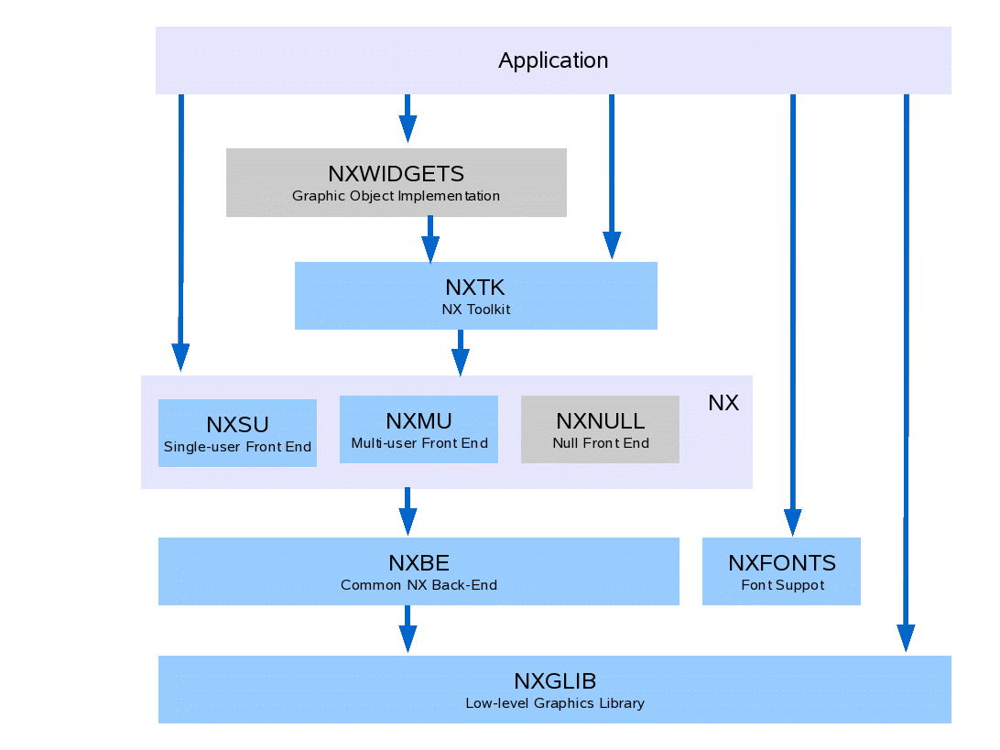

Organization
------------

NX is organized into 6 (and perhaps someday 7 or 8) logical modules.
These logical modules also correspond to the directory organization.
That NuttX directory organization is discussed in `Appendix
B <#grapicsdirs>`__ of this document. The logic modules are discussed in
the following sub-paragraphs.

   Figure 2: NX organization.

1. **NX Graphics Library (NXGL):** NXGLIB is a standalone library
   that contains low-level graphics utilities and direct framebuffer
   or LCD rendering logic. NX is built on top NXGLIB. See :ref:`nxgl`.

2. **NX (NXSU and NXMU):** NX is the tiny NuttX windowing system
   for raw windows (i.e., simple regions of graphics memory).
   NX includes a small-footprint, multi-user implementation
   (NXMU as described below). NX can be used without NxWidgets and without
   NXTOOLKIT for raw window displays.

   NXMU and NXSU are interchangeable other than:

   1. Certain start-up and initialization APIs (as described below), and
   2. Timing.

   With NXSU, NX APIs execute immediately; with NXMU, NX APIs defer and
   serialize the operations and, hence, introduce different timing and
   potential race conditions that you would not experience with NXSU.

   **NXNULL** At one time, I also envisioned a *NULL* front-end that did
   not support windowing at all but, rather, simply provided the entire
   framebuffer or LCD memory as one dumb window.
   This has the advantage that the same NX APIs can be used on the one dumb
   window as for the other NX windows.
   This would be in the NuttX spirit of scalability.

   However, the same end result can be obtained by using the
   :c:func:`nx_requestbkgd` API.
   It still may be possible to reduce the footprint in this usage case
   by developing and even thinner NXNULL front-end.
   That is a possible future development.

3. **NX Tool Kit (``NXTK``):** NXTK is a s set of C graphics tools
   that provide higher-level window drawing operations.
   This is the module where the framed windows and toolbar logic
   is implemented.
   NXTK is built on top of NX and does not depend on NxWidgets.

4. **NX Fonts Support (NXFONTS):** A set of C graphics tools for present
   (bitmap) font images. The font implementation is at a very low level
   or graphics operation, comparable to the logic in NXGLIB.
   NXFONTS does not depend on any NX module other than some utilities
   and types from NXGLIB.

5. **NX Widgets (NxWidgets):** :ref:`nxwidgets` is a higher level, C++,
   object-oriented library for object-oriented access to graphical "widgets".
   NxWidgets is provided as a separate library in the ``nuttx-apps/``
   repository NxWidgets is built on top of the core NuttX graphics subsystem,
   but is part of the application space rather than part of the core OS
   graphics subsystems.

6. **Terminal Driver (NxTerm):** NxTerm is a write-only character device
   (not shown) that is built on top of an NX window.
   This character device can be used to provide ``stdout`` and ``stderr`` and,
   hence, can provide the output side of NuttX console.
